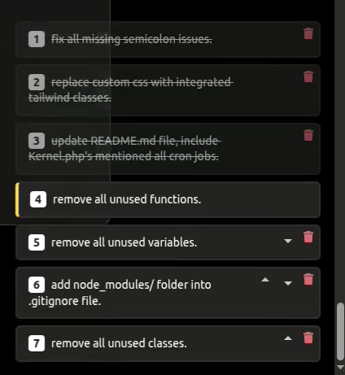

# Codex task – Code++ Q
ueue Helper

Adds a **“Code++”** button to Codex task pages on ChatGPT, letting you stack prompts in a persistent queue that shows as draggable, resizable toast cards. Each toast can be reordered (up/down) or deleted, and the queue auto-executes one prompt after another while visually marking items as **processing** or **done**.

| | |
| --- | --- |
| **Userscript name** | `Codex task – Code++ queue helper` |
| **Current version** | 0.1.0 |
| **Match URL** | `https://chatgpt.com/codex/tasks/task*` |
| **Permissions** | _none_ (pure DOM / `localStorage`) |
| **License** | MIT |

## ✨ Features

- **Queue anything** – every time you click **Code++**, the current prompt text is stored for later.
- **Persistent** – queue survives reloads via `localStorage`, keyed per-task URL.
- **Numbered toast cards** – always at least **375 px** wide; drag the left edge to resize.
- **Inline SVG icons** – CSP-friendly (no external assets).
- **Reorder & delete** – up / down arrows plus a trash can.
- **Auto-execution** – picks the next queued prompt, injects it, clicks **Code**, waits for completion, and moves on.
- **Visual states** – border color shows **processing**, strikethrough marks **done**.

## 🖼️ Screenshots

### "Code++" button:


### Queue list:


## ⚡ Quick Install

1. **Browser extension:**  
   - Chrome / Edge / Brave: install [Tampermonkey](https://www.tampermonkey.net/).  
   - Firefox: install [Violentmonkey](https://violentmonkey.github.io/) or Tampermonkey.
2. Click the **Raw** button on [`code-plus-plus.user.js`](./code-plus-plus.user.js) (or copy its contents) and confirm the install dialog.
3. Visit any Codex task page (URL starts with `https://chatgpt.com/codex/tasks/task`).
4. Look for a shiny **Code++** button next to the stop button. Queue away!

## 🛠️ How it works

| Stage | What happens |
| ----- | ------------ |
| **Inject button** | A MutationObserver watches for the built-in Stop button and appends **Code++** right beside it. |
| **Queue prompt** | Clicking **Code++** reads `#prompt-textarea`, stores its text in `localStorage` under a per-page key, and renders a toast. |
| **Render toasts** | Toasts live in a fixed container bottom-right. Each card shows its index badge, prompt text, and action icons. |
| **Resize / move / delete** | Drag the slim left handle to resize; click arrows to reorder, trash to remove. |
| **Auto-run** | On load or after each Code run, the script checks the queue, types the next prompt, clicks **Code**, and updates toast state. |

## 🔧 Configuration

| Constant | Purpose | Default |
| -------- | ------- | ------- |
| `MIN_WIDTH` | Minimum toast width | `375` |
| `LS_PREFIX` | LocalStorage key prefix | `code-plus-plusQueue:` |
| `CODE_TIMEOUT` | Max wait for a Code run (ms) | `600_000` (10 min) |

Tweak them near the top of the script if needed.

## 📦 Repository layout

```text
└── /                   # root
    ├── code-plus-plus.user.js  # the userscript
    ├── README.md              # you are here
    └── .editorconfig / .eslintrc / etc. (optional)
```

## 🚀 Roadmap

- ✅ Initial queue, resize, reorder, auto-run.
- [ ] Keyboard shortcuts (e.g. ⌘ + Enter to queue).
- [ ] Export / import queue (JSON / clipboard).
- [ ] Dark/light theme detection.

PRs welcome!

## 🤝 Contributing

1. Fork the repo.
2. Create a feature branch: `git checkout -b feat/amazing-idea`.
3. Commit your changes: `git commit -m "feat: add amazing idea"`.
4. Push and open a Pull Request.

Style guide: keep code 💯% vanilla JS (ES2020+) – no build step.

## 🐛 Issues / Support

- Found a bug? Open an [issue](../../issues) and include:
    - Browser + extension version
    - Script version
    - Reproduction steps / console errors
- Need a quick fix? Ping me on **discussions**.

## 📜 License

MIT © 2025 @otanim (Arman Yeghiazaryan)

---

Happy coding 🚀
```